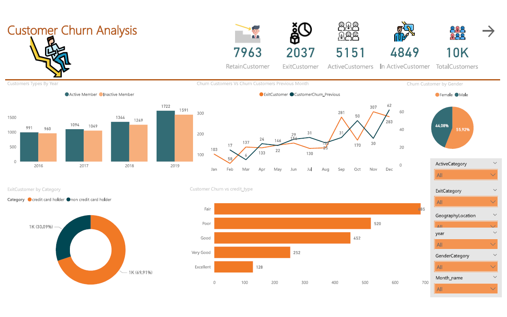

<h2>Customer Churn Dashboard 🧐</h2>

<h1>Customer Churn Analysis In Banking Domain 🏦</h1>
<p1>Analyse the data and bring out a few insights on the customer Churn.
It is advantageous for banks to know what leads a client toward the decision to leave the company.
Churn prevention allows companies to develop loyalty programs and retention campaigns to keep as many customers as possible.</p1>

 
